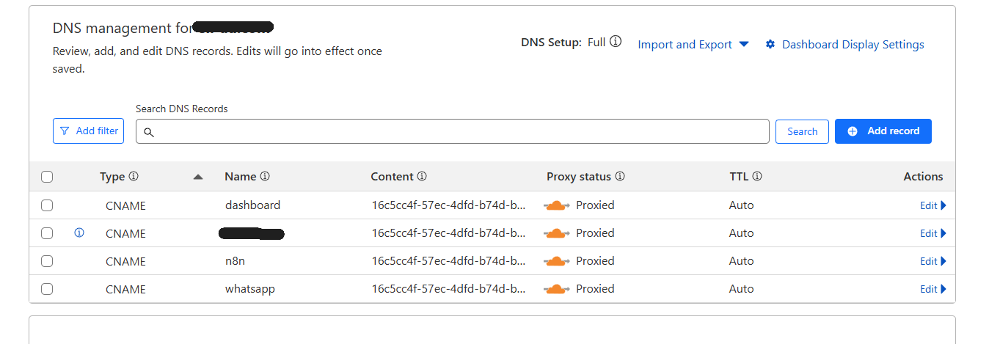

🚀 Automation Stack – Full Self-Hosted Deployment Guide

This repo sets up:

- n8n automation with Redis & PostgreSQL
- WhatsApp MCP (Multi-tool control API)
- React dashboard at `/ui`
- Cloudflare tunneling (HTTPS access without ports)
- Auto-start & daily Postgres backup

## ☁️ Requirements

- A domain name (required for Cloudflare tunnels)
- Docker & Docker Compose
- curl, git, and crontab (Linux)

---

## 📦 1. Clone Repository

```bash
git clone https://github.com/Zie619/automation-stack.git
cd automation-stack
```

---

## 🌐 2. Install & Configure Cloudflared

**Linux:**

```bash
wget https://github.com/cloudflare/cloudflared/releases/latest/download/cloudflared-linux-amd64.deb
sudo dpkg -i cloudflared-linux-amd64.deb
```

**Mac:**

```bash
brew install cloudflared
```

**Windows:**

```bash
winget install --id Cloudflare.cloudflared
# or
choco install cloudflared
```

### Login and create tunnel

```bash
cloudflared tunnel login
cloudflared tunnel create n8n-tunnel-example
```

After login, note the JSON credentials path. For example:
`/root/.cloudflared/ac167143-2428-4b3c-91fc-0d1579e984cf.json`

### Create config.yml

**Linux:**
```bash
sudo nano /etc/cloudflared/config.yml
```

**Windows:** Edit `C:\Users\Administrator\.cloudflared\config.yml`

```yaml
tunnel: n8n-tunnel
credentials-file: /root/.cloudflared/your-tunnel.json

ingress:
  - hostname: n8n.yourdomain.com
    service: http://localhost:5678
  - hostname: whatsapp.yourdomain.com
    service: http://localhost:8000
  - hostname: dashboard.yourdomain.com
    service: http://localhost:5137
  - service: http_status:404
```
in cloudflare go to the dns managment and add the domains as in the image whatsapp.yourdomain.com and dashboard.yourdomain.com


### Enable tunnel on boot (Linux)

```bash
sudo tee /etc/systemd/system/cloudflared.service > /dev/null <<EOF
[Unit]
Description=cloudflared
After=network.target

[Service]
ExecStart=/usr/bin/cloudflared --no-autoupdate --config /etc/cloudflared/config.yml tunnel run
Restart=always

[Install]
WantedBy=multi-user.target
EOF

sudo systemctl enable cloudflared
sudo systemctl start cloudflared
```

### Manual (Windows):
Open terminal and run:
```bash
cloudflared tunnel run n8n-tunnel-example
```

---

## 🔐 3. Setup .env File

Create a `.env` file in the root folder:

```env
# PostgreSQL
POSTGRES_USER=yourusername
POSTGRES_PASSWORD=yourpassword
POSTGRES_DB=n8n
POSTGRES_PORT=5432
POSTGRES_HOST=postgres

# Redis
REDIS_HOST=redis
QUEUE_MODE=redis

# n8n
N8N_PORT=5678
N8N_AUTH_ACTIVE=true
N8N_AUTH_USER=yourusername
N8N_AUTH_PASS=yourpassword
N8N_BASE_URL=https://n8n.yourdomain.com
N8N_WEBHOOK_URL=https://n8n.yourdomain.com

# WhatsApp MCP
MCP_PORT=8000
MCP_AUTH_USER=yourusername
MCP_AUTH_PASS=yourpassword
```

---

## 🧱 4. Build & Launch Docker Services

**Build React UI (required only if using dashboard):**

```bash
cd whatsapp-mcp/whatsapp-dashboard
npm install
npm run build
```

**Build Docker containers:**

```bash
cd automation-stack
docker compose build
docker compose up -d
```

**💡 Don't want the UI?**
Comment/remove this line in `docker-compose.yml` under `whatsapp-mcp-server` service:
```yaml
- ./whatsapp-mcp/whatsapp-dashboard/dist:/app/whatsapp-mcp-server/ui
```

---

## ♻️ 5. Auto-Restart & Daily Backup (Linux)

```bash
crontab -e
```

Paste the following:

```cron
@reboot sleep 30 && cd /root/n8n && docker compose up -d
@reboot sleep 60 && cd /root/automation-stack && docker compose build whatsapp-mcp-server && docker compose up -d whatsapp-mcp-server
0 2 * * * /root/backup_postgres.sh
```

---

## 🗄️ 6. PostgreSQL Backup

Backups are saved automatically in `n8n_postgres_backups/`
To restore:

```bash
docker exec -i n8n-postgres psql -U yourusername -d n8n < backup_file.sql
```

---

## 🔌 7. WhatsApp MCP API & GPT Tooling

Use Basic Auth:
- Username: `MCP_AUTH_USER`
- Password: `MCP_AUTH_PASS`

**Run tool:**

```http
POST https://whatsapp.yourdomain.com/run_tool
```

**List GPT-compatible tools:**

```http
GET https://whatsapp.yourdomain.com/openai-tools
```

Output format is OpenAI function-call compatible.

---

## 🧠 8. React UI Dashboard

**UI location:** `https://whatsapp.yourdomain.com/ui`

**Rebuild after changes:**

```bash
cd whatsapp-mcp/whatsapp-dashboard
npm run build
cd automation-stack
docker compose build whatsapp-mcp-server
docker compose up -d whatsapp-mcp-server
```

---

## 📲 9. Link WhatsApp Device (Scan QR Code)

Before using the WhatsApp MCP server, you must link a WhatsApp account to it by scanning a QR code.

### 📸 Step-by-Step

1. Ensure the WhatsApp bridge container is running:

```bash
docker ps | grep whatsapp-bridge
```

If it's not running:

```bash
docker compose up -d whatsapp-bridge
```

2. View the QR code from logs:

```bash
docker logs -f whatsapp-bridge
```

Scroll up until you see a **QR code** printed as ASCII art in the terminal.

3. Open **WhatsApp** on your phone:

* Go to **Settings** → **Linked Devices**
* Tap **Link a Device**
* Scan the QR code displayed in the terminal

4. Wait for confirmation. The terminal will show `authenticated` or `ready`.

You are now connected. Your WhatsApp account is ready to send/receive messages via the MCP tools.

---

Let me know if you want this injected directly into the README file as well.

---

## 🌍 Subdomains Recap

| Subdomain                  | Description                     |
|----------------------------|---------------------------------|
| n8n.yourdomain.com         | n8n Automation Interface         |
| whatsapp.yourdomain.com    | WhatsApp MCP API & UI           |
| dashboard.yourdomain.com   | Optional: React Dashboard UI    |

---

## 🧰 Maintenance

Restart WhatsApp MCP:
```bash
docker compose restart whatsapp-bridge whatsapp-mcp-server
```

View logs:
```bash
docker logs -f whatsapp-mcp-server
```

---
## 🪢 How to Use the whatsapp MCP in n8n

### Go to n8n, add a costum mcp node and figure it out ;) maybe in a later update I will add a section on that.
---

## 🤖 Optiontional - if you are going to fork this repo or use git, add a gitignore file

**optional git ignore for begginers:**

```bash
# === PYTHON ===
__pycache__/
*.py[cod]
*.egg
*.egg-info/
dist/
build/
.env
.venv/
venv/
*.log

# === NODE / REACT (dashboard) ===
node_modules/
*.log
npm-debug.log*
yarn-debug.log*
yarn-error.log*
.pnpm-debug.log
*.lock
whatsapp-mcp/whatsapp-dashboard/dist/

# === DOCKER / SYSTEM ===
*.pid
*.sock
docker-compose.override.yml

# === BACKUPS ===
n8n_postgres_backups/
*.sql
*.dump

# === OS / SYSTEM ===
.DS_Store
Thumbs.db
ehthumbs.db
*.swp
*.swo
*~

# === CLOUD FLARE TUNNEL CREDENTIALS (should never be committed) ===
/.root/.cloudflared/
*.pem
*.json

# === IDE SETTINGS ===
.vscode/
.idea/

```

## 👤 Maintainer
**Eliad Shahar** – Open source automation enthusiast.

**lharries Credit**: [lharries Whatsapp mcp](https://github.com/lharries/whatsapp-mcp) 